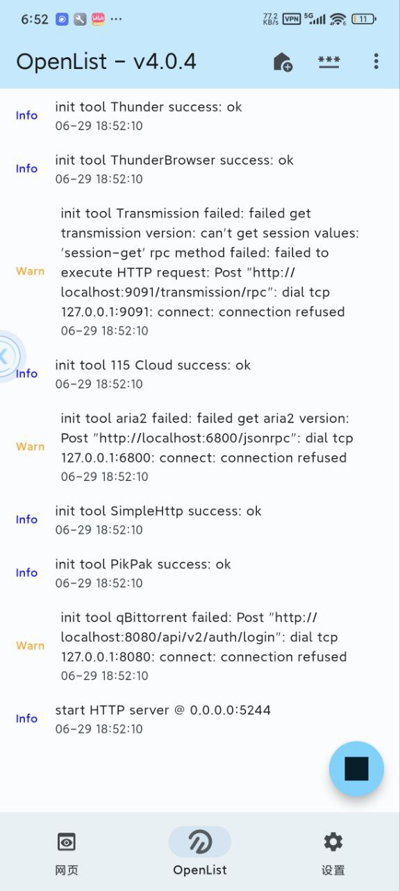

# OpenListFlutter

OpenListFlutter是一个基于OpenList的Android服务端，使用Google Flutter作为UI框架。

> [Github Actions](https://github.com/OpenListTeam/OpenListFlutter/actions/workflows/sync_openlist.yaml)
> 每日早晚五点钟检查最新的 [OpenList](https://github.com/OpenListTeam/OpenList/releases)
> 并自动构建APK，发布到 [Release](https://github.com/OpenListTeam/OpenListFlutter/releases)
> 中，您只需耐心等待片刻并在应用内检查更新即可。

### 关于IOS
理论上 [Gomobile](https://pkg.go.dev/golang.org/x/mobile/cmd/gomobile?utm_source=godoc#hdr-Build_a_library_for_Android_and_iOS) 支持IOS，项目组在积极支持中。

# Download

- [Github Action (DEV)](https://github.com/OpenListTeam/OpenListFlutter/actions/workflows/build.yaml) 开发版

